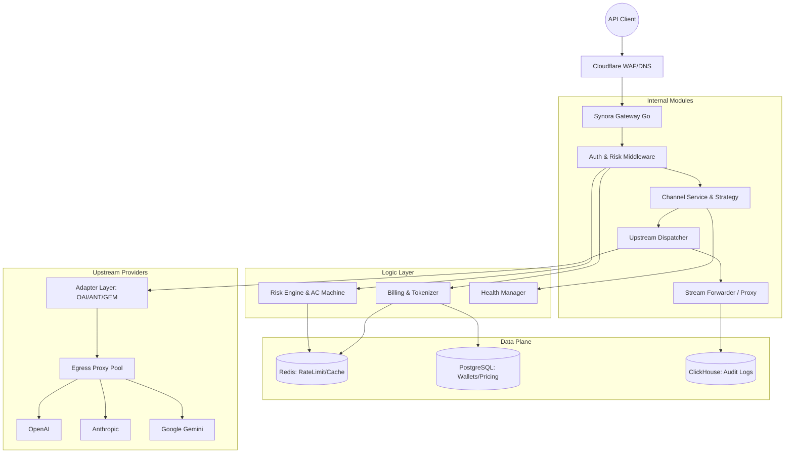

# Synora Gateway

Synora Gateway 是一款专为企业级 AI 应用设计的、高性能、高可用的 AI 模型中转与调度网关。它不仅实现了多协议的完美适配，更核心地提供了多通道智能容灾、实时 Token 计费、自动化风控以及出口代理隔离，致力于为企业提供“稳定、合规、透明”的 AI 能力接入。

---

## 🏗️ 系统架构

Synora Gateway 采用 **单体网关 + 异构数据面** 的极简高可用架构，旨在单人运维环境下实现 99.9% 以上的可用性。



---

## 🚀 核心特性

### 1. 智能容灾与调度 (Failover & Routing)
- **多通道映射**：逻辑模型（如 `gpt-4o`）动态映射至多个物理通道。
- **健康分算法**：基于滑动窗口计算，综合失败率、429 率及 P95 延迟，自动进行熔断与降级。
- **零字节切换**：在流式响应首个 Chunk 吐出前，支持透明的静默重试。

### 2. 多协议矩阵 (Protocol Matrix)
- **原生入口支持**：
    - **OpenAI**: `/v1/chat/completions` (支持 Tool Call, Stream)
    - **Anthropic**: `/v1/messages` (完美适配 Claude Code/Cursor)
    - **Gemini**: `/v1beta/models/*:generateContent` (适配 Google AI Studio SDK)
- **交叉协议转换**：各厂家上游可自由组合，实现跨厂商协议的逐 Chunk 实时流式互转。

### 3. 精准 Token 计费 (Real Billing)
- **实时 Token 统计**：集成 `tiktoken`，对所有请求进行实时输入/输出 Token 计数。
- **流式拦截计费**：在 SSE 转发过程中动态解析内容并累计计费，避免传统网关必须缓冲响应的延迟问题。
- **预付费钱包**：基于 PostgreSQL 悲观锁确保高并发下的账户余额绝对一致性。

### 4. 自动化风控五道防线 (Risk Control)
- **声明式规则**：通过 YAML 配置日消费限额、分钟级突发限制等。
- **自动止损循环**：后台异步扫描器每 30 秒评估用户指标，超标自动冻结 API Key。
- **内容审核**：集成 Aho-Corasick 算法的本地敏感词过滤 + 上游 Moderation 同步校验。

### 5. 企业级合规保证 (Compliance)
- **出口代理池 (Egress Proxy)**：支持按通道配置独立的出口代理（美西/美东/亚太），物理隔离上游反作弊风险。
- **公开状态页**：提供 `/public/status` API，实时公开系统可用率与延迟分布。
- **审计日志**：ClickHouse 存储，支持 90 天全量调用日志留存与一键导出。

---

## 📂 项目结构

```text
synora-gateway/
├── cmd/server/            # 程序入口 (main.go)
├── internal/
│   ├── adapter/           # 协议适配层 (OpenAI/Anthropic/Gemini)
│   ├── api/               # API Handlers (Chat/Billing/Status)
│   ├── audit/             # 审计日志调度器
│   ├── billing/           # 计费、Tokenizer 与钱包服务
│   ├── risk/              # 风控引擎与自动规则评价
│   ├── router/            # 通道管理、健康分算法与路由策略
│   ├── upstream/          # 调度引擎、流式转发与代理管理
│   └── storage/           # PG/Redis/ClickHouse 初始化
├── migrations/            # 数据库 Schema 迁移
└── deploy/                # Docker, 风险规则与部署配置
```

---

## 📦 快速开始

### 1. 环境准备
```bash
docker-compose -f deploy/docker-compose.yml up -d
```

### 2. 数据库迁移
系统会自动检测 `migrations` 目录。

### 3. API 调用示例

#### OpenAI 协议入口
```bash
curl http://localhost:8080/v1/chat/completions \
  -H "Authorization: Bearer sk-synora-xxx" \
  -d '{"model": "gpt-4o", "messages": [{"role": "user", "content": "Hello"}]}'
```

#### Gemini 原生协议入口
```bash
curl http://localhost:8080/v1/models/gemini-1.5-pro:generateContent \
  -H "Authorization: Bearer sk-synora-xxx" \
  -d '{"contents": [{"parts": [{"text": "Explain quantum physics"}]}]}'
```

---

## 📜 授权协议

本项目采用 [GPLv3](./LICENSE) 协议开源。
